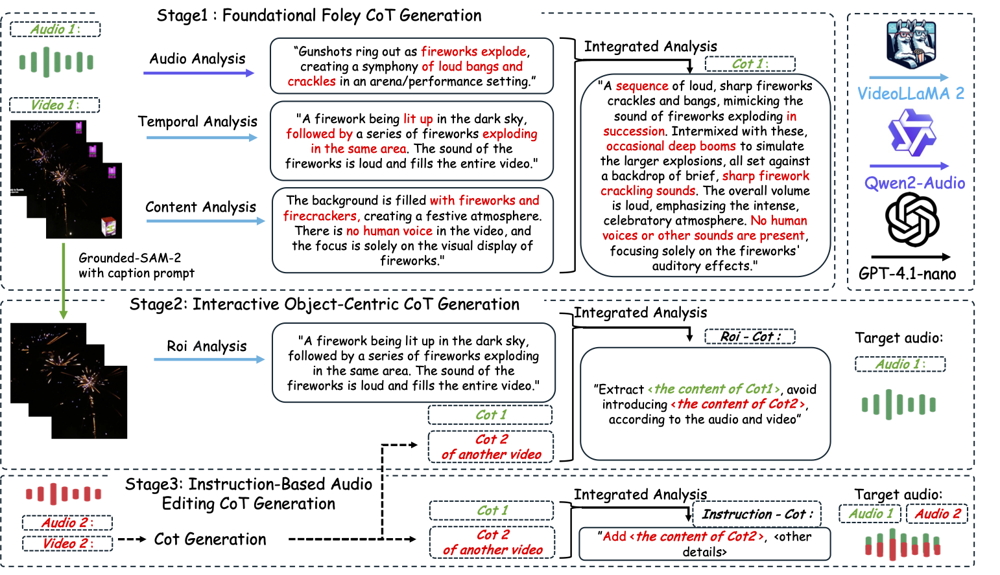

<h1 align="center">ThinkSound</h1>

<p align="center">
  🌐
  <a href="https://openaitx.github.io/view.html?user=FunAudioLLM&project=ThinkSound&lang=en">English</a> |
  <a href="https://openaitx.github.io/view.html?user=FunAudioLLM&project=ThinkSound&lang=zh-CN">简体中文</a> |
  <a href="https://openaitx.github.io/view.html?user=FunAudioLLM&project=ThinkSound&lang=zh-TW">繁體中文</a> |
  <a href="https://openaitx.github.io/view.html?user=FunAudioLLM&project=ThinkSound&lang=es">Español</a> |
  <a href="https://openaitx.github.io/view.html?user=FunAudioLLM&project=ThinkSound&lang=fr">Français</a> |
  <a href="https://openaitx.github.io/view.html?user=FunAudioLLM&project=ThinkSound&lang=ja">日本語</a>
  
</p>

<p align="center">
  <a href="https://arxiv.org/pdf/2506.21448">
    
  </a>
  &nbsp;
  <a href="https://thinksound-project.github.io/">
    
  </a>
  &nbsp;
  <a href="https://huggingface.co/spaces/FunAudioLLM/ThinkSound">
    
  </a>
  &nbsp;
  <a href="https://modelscope.cn/studios/iic/ThinkSound">
    
  </a>
</p>

<p align="center">
  If you find this project useful,<br>
  a star ⭐ on GitHub would be greatly appreciated!
</p>

---

**ThinkSound** is a unified Any2Audio generation framework with flow matching guided by Chain-of-Thought (CoT) reasoning.

PyTorch implementation for multimodal audio generation and editing: generate or edit audio from video, text, and audio, powered by step-by-step reasoning from Multimodal Large Language Models (MLLMs).


---

## 📰 News
- **2025.07.15** &nbsp; 📦 Simplified installation and usability: dependencies on PyPI for easy cross-platform setup; Windows `.bat` scripts automate environment creation and script running.
- **2025.07.08** &nbsp;  🔧 Major update: model lightweighted and optimized memory and GPU usage, now supports high-throughput audio generation at scale!
- **2025.07.01** &nbsp; 🔥Online demo on [Hugging Face Spaces](https://huggingface.co/spaces/FunAudioLLM/ThinkSound) and [ModelScope](https://modelscope.cn/studios/iic/ThinkSound) for interactive experience!
- **2025.07.01** &nbsp; 🔥Released inference scripts and web interface; 
- **2025.06** &nbsp; 🔥[ThinkSound paper](https://arxiv.org/pdf/2506.21448) released on arXiv!
- **2025.06** &nbsp; 🔥[Online Demo](http://thinksound-project.github.io/) is live - try it now!

---


## 🚀 Features

- **Any2Audio**: Generate audio from arbitrary modalities — video, text, audio, or their combinations.
- **Video-to-Audio SOTA**: Achieves state-of-the-art results on multiple V2A benchmarks.
- **CoT-Driven Reasoning**: Chain-of-Thought reasoning for compositional and controllable audio generation via MLLMs.
- **Interactive Object-centric Editing**: Refine or edit specific sound events by clicking on visual objects or using text instructions.
- **Unified Framework**: One foundation model supports generation, editing, and interactive workflow.

---

## ✨ Method Overview

ThinkSound decomposes audio generation and editing into three interactive stages, all guided by MLLM-based Chain-of-Thought (CoT) reasoning:

1. **Foley Generation:** Generate foundational, semantically and temporally aligned soundscapes from video.
2. **Object-Centric Refinement:** Refine or add sounds for user-specified objects via clicks or regions in the video.
3. **Targeted Audio Editing:** Modify generated audio using high-level natural language instructions.


<!-- A large-scale CoT-annotated dataset (**AudioCoT**) is used to train both the reasoning module and the unified audio foundation model.
 -->

---

## ⚡ Quick Start

**Environment Preparation:**
```bash
git clone https://github.com/liuhuadai/ThinkSound.git
cd ThinkSound
conda create -n thinksound python=3.10
conda activate thinksound
pip install thinksound
conda install -y -c conda-forge 'ffmpeg<7'
# Download pretrained weights https://huggingface.co/liuhuadai/ThinkSound to Directory ckpts/
# model weights can be also downloaded from https://www.modelscope.cn/models/iic/ThinkSound
git lfs install
git clone https://huggingface.co/liuhuadai/ThinkSound ckpts
# To improve inference and training speed, you may optionally install a FlashAttention backend compatible with your system and PyTorch version.
```

> ✅ **Windows Tip:**  
> Windows users can simply run `setup_windows.bat` (or double-click it) to automatically create the conda environment, install all dependencies (including FFmpeg), and download the pretrained model — no manual setup required.  
> Make sure `conda` and `git` are installed and available in your system PATH before running the script.


### ▶️ Run the Demo

#### **Linux/macOS**

```bash
chmod +x scripts/demo.sh
./scripts/demo.sh <path-to-your-demo-video> <title> <CoT description> [use-half]
```

#### **Windows**

You can use the provided `.bat` script instead:

```bash
.\scripts\demo.bat <path-to-your-demo-video> <title> <CoT description> [use-half]
```

**Note:**

* `<path-to-your-demo-video>`: The path to a single video
* `[use-half]` (optional): Add use-half at the end to enable half precision feature extraction.

---

### 📦 Batch Inference

#### **Linux/macOS**

```bash
chmod +x scripts/eval_batch.sh
./scripts/eval_batch.sh <video_path> <csv_path> <save_path (optional)> [use-half]
```

#### **Windows**

Use the equivalent `.bat` script:

```bash
.\scripts\eval_batch.bat <video_path> <csv_path> <save_path (optional)> [use-half]
```

**Note:**

* `<video_path>`: Path to the root directory containing all .mp4 videos to be processed (all videos must be of equal duration).
* `<csv_path>`: A CSV file with text prompts for each video (see `demo_test.csv` for format).
* `<save_path>` (optional): Where to save generated audio. Defaults to `results/features`.
* `[use-half]` (optional): Add use-half at the end to enable half precision feature extraction.

---


### Web Interface Usage

For an interactive experience, launch the Gradio web interface:

```bash
python app.py
```

---

## 📝 TODO
* - [ ] Release training scripts for ThinkSound models
* - [ ] Open-source AudioCoT dataset and automated pipeline
* - [ ] Provide detailed documentation and API reference
* - [ ] Add support for additional modalities and downstream tasks
* - [ ] Release models at different scales
* - [ ] Provide a ready-to-use environment image
* - [x] A beginner-friendly Windows quick-start README
---

## 📄 License

This project is released under the Apache 2.0 License.

> **Note:**
> The code, models, and dataset are **for research and educational purposes only**.
> **Commercial use is NOT permitted.**
> For commercial licensing, please contact the authors.

**📦 Third-Party Components**

* **Stable Audio Open VAE** (by Stability AI):
  This repository includes a fine-tuned VAE from [Stable Audio Open](https://huggingface.co/stabilityai/stable-audio-open-1.0/), licensed under the [Stability AI Community License](./third_party/LICENSE_StabilityAI.md).
  **Commercial use and redistribution require prior permission from Stability AI.**

* 📘 **All other code and models** are released under the Apache License 2.0.

---

## Acknowledgements

Many thanks to:

* **stable-audio-tools** (by Stability AI):
For providing an easy-to-use framework for audio generation, as well as the VAE module and weights.
* **MMAudio**:
  For the implementation of the MM-DiT backbone in the audio domain.

---

## 📖 Citation

If you find ThinkSound useful in your research or work, please cite our paper:

```bibtex
@misc{liu2025thinksoundchainofthoughtreasoningmultimodal,
      title={ThinkSound: Chain-of-Thought Reasoning in Multimodal Large Language Models for Audio Generation and Editing}, 
      author={Huadai Liu and Jialei Wang and Kaicheng Luo and Wen Wang and Qian Chen and Zhou Zhao and Wei Xue},
      year={2025},
      eprint={2506.21448},
      archivePrefix={arXiv},
      primaryClass={eess.AS},
      url={https://arxiv.org/abs/2506.21448}, 
}
```

---

## 📬 Contact

✨ Feel free to [open an issue](https://github.com/liuhuadai/ThinkSound/issues) or contact us via email ([liuhuadai@zju.edu.cn](mailto:liuhuadai@zju.edu.cn)) if you have any questions or suggestions!
