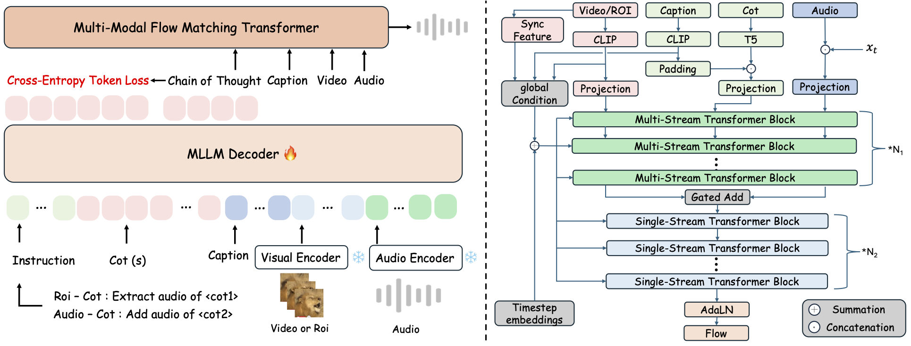

# 🎶 ThinkSound

<p align="center">
  If you find this project useful, a star ⭐ on GitHub would be greatly appreciated!
</p>

<p align="center">
  <a href="https://arxiv.org/pdf/2506.21448">
    
  </a>
  &nbsp;
  <a href="https://thinksound-project.github.io/">
    
  </a>
  <!-- &nbsp;
  <a href="https://huggingface.co/spaces/FunAudioLLM/ThinkSound">
    
  </a>
  &nbsp;
  <a href="https://www.modelscope.cn/studios/ThinkSound/ThinkSound/summary">
    
  </a> -->
</p>

---

**ThinkSound** is a unified Any2Audio generation framework with flow matching guided by Chain-of-Thought (CoT) reasoning.

PyTorch implementation for multimodal audio generation and editing: generate or edit audio from video, text, and audio, powered by step-by-step reasoning from Multimodal Large Language Models (MLLMs).


---

## 📰 News
<!-- online demo on [Hugging Face Spaces](#) and [ModelScope](#) for interactive experience! -->
- **2025.07** &nbsp; 🔥Released inference scripts; 
- **2025.06** &nbsp; 🔥[ThinkSound paper](https://arxiv.org/pdf/2506.21448) released on arXiv!
- **2025.06** &nbsp; 🔥[Online Demo](http://thinksound-project.github.io/) is live - try it now!

---

## 🚀 Features

- **Any2Audio**: Generate audio from arbitrary modalities — video, text, audio, or their combinations.
- **Video-to-Audio SOTA**: Achieves state-of-the-art results on multiple V2A benchmarks.
- **CoT-Driven Reasoning**: Chain-of-Thought reasoning for compositional and controllable audio generation via MLLMs.
- **Interactive Object-centric Editing**: Refine or edit specific sound events by clicking on visual objects or using text instructions.
- **Unified Framework**: One foundation model supports generation, editing, and interactive workflow.

---

## ✨ Method Overview

ThinkSound decomposes audio generation and editing into three interactive stages, all guided by MLLM-based Chain-of-Thought (CoT) reasoning:

1. **Foley Generation:** Generate foundational, semantically and temporally aligned soundscapes from video.
2. **Object-Centric Refinement:** Refine or add sounds for user-specified objects via clicks or regions in the video.
3. **Targeted Audio Editing:** Modify generated audio using high-level natural language instructions.


<!-- A large-scale CoT-annotated dataset (**AudioCoT**) is used to train both the reasoning module and the unified audio foundation model.
 -->

---

## ⚡ Quick Start

**Environment Preparation:**
```bash
git clone https://github.com/liuhuadai/ThinkSound.git
cd ThinkSound
pip install -r requirements.txt
conda install -y -c conda-forge 'ffmpeg<7'
# Download pretrained weights to Directory ckpts/
git lfs install
git clone https://huggingface.co/liuhuadai/ThinkSound
```

**Make it executable**
```bash
chmod +x scripts/demo.sh
```

**Run the script**
```bash
./scripts/demo.sh <video_path> <title> <CoT description>
```


### Web Interface Usage

For an interactive experience, launch the Gradio web interface:

```bash
python app.py
```

---

## 📝 TODO

- ☐ Release training scripts for ThinkSound models
- ☐ Open-source AudioCoT dataset and automated pipeline
- ☐ Provide detailed documentation and API reference
- ☐ Add support for additional modalities and downstream tasks

---

## 📄 License

This project is released under the [Apache 2.0 License](LICENSE).

> **Note:**  
> The code, models, and dataset are **for research and educational purposes only**.  
> **Commercial use is NOT permitted.**
>
> For commercial licensing, please contact the authors.

---

## 📖 Citation

If you find ThinkSound useful in your research or work, please cite our paper:

```bibtex
@misc{liu2025thinksoundchainofthoughtreasoningmultimodal,
      title={ThinkSound: Chain-of-Thought Reasoning in Multimodal Large Language Models for Audio Generation and Editing}, 
      author={Huadai Liu and Jialei Wang and Kaicheng Luo and Wen Wang and Qian Chen and Zhou Zhao and Wei Xue},
      year={2025},
      eprint={2506.21448},
      archivePrefix={arXiv},
      primaryClass={eess.AS},
      url={https://arxiv.org/abs/2506.21448}, 
}
```

---

## 📬 Contact

✨ Feel free to [open an issue](https://github.com/liuhuadai/ThinkSound/issues) or contact us via email ([liuhuadai@zju.edu.cn](mailto:liuhuadai@zju.edu.cn)) if you have any questions or suggestions!